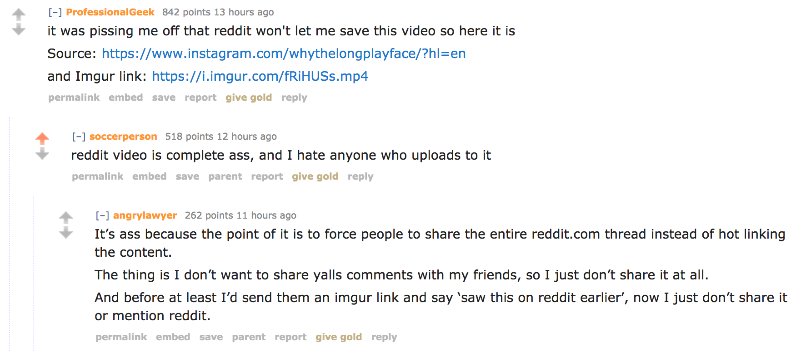

# Reddit Smart Share

Simple extension to make it easier to share things from Reddit.

### What does it to?

This plugin just adds a small icon to the top left corner of any reddit video player with link to the direct video URL.

You can simply right click the link and copy the url or just click the link and copy it from the URL bar.

Additionally, you can use this link to download the video and then upload it to another hosting service \*cough\*imgur\*cough\*.

### Why?

I often want to share content from reddit, but don't want to link to Reddit. For example, taking an animated gif and sharing it in a chat or e-mail.

### Inspiration

This extension was inspired by this thread...

